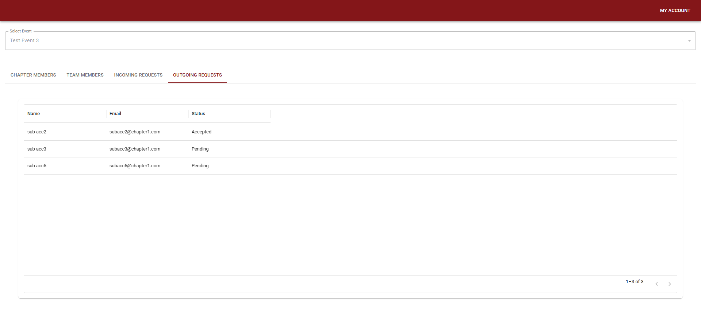

### **Requirements**

The client’s business focused on providing corporate training sessions, utilizing the MemberPress plugin. Some of the training sessions were conducted in person through organized events. These events were either team-based or individual, and the client wanted to introduce functionality that allowed members from the same corporate firm to form teams.

---

### **Approach**

The client was using the MemberPress Corporate Accounts add-on to enable corporate accounts to add their members and grant access to purchased content. However, it lacked the following essential functionalities:  

- **Event Scheduling**  
- **Event Enrollment**  
- **Team Creation**  
- **Automatic Clean-Up**

To address these gaps, a custom add-on plugin was developed, incorporating the above-mentioned modules. Each module is detailed below.  

---

### **Event Scheduling**

This module was designed to allow the admin team to schedule events. A custom database table was created to store event details, along with a dedicated admin page for creating and listing events.  

---

### **Event Enrollment**

During registration, users could select the type of event they wished to participate in. Once an event matching their selected type was scheduled—either at the time of registration or in the future—the system automatically enrolled the user in the event. Users could also modify their selected event type if needed.  

---

### **Team Creation**

This module enabled enrolled users to form teams with other users from the same corporate firm. Users could send and accept team requests to join or form teams. If a team request was not responded to within a set period, it would automatically expire and become invalid.  

---

### **Automatic Clean-Up**

To maintain data hygiene, a clean-up module was implemented to remove outdated information. Once an event reached its end date, the event and all associated data, such as team details, were automatically deleted.  